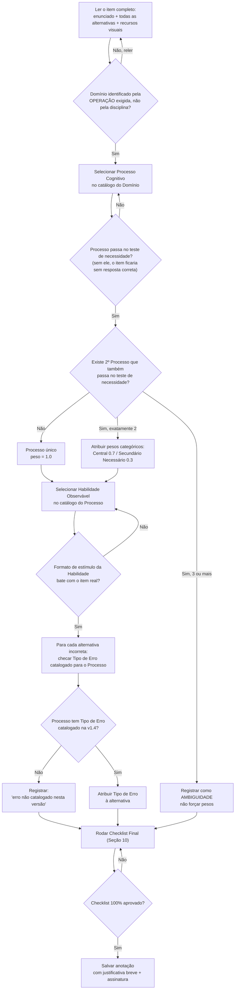

# Manual Oficial de Anotação Cognitiva Sapiens

## v1.0

Documento operacional, construído sobre os três artefatos normativos congelados do projeto: White Paper Sapiens 2.0, Constituição da Ontologia Sapiens, e Ontologia Cognitiva Sapiens v1.4. Nenhum Domínio, Processo, Competência, Habilidade, Tipo de Erro ou Intervenção é criado, removido ou reorganizado neste documento — todo IDs citados abaixo referem-se exclusivamente ao catálogo já congelado (11 Domínios, 25 Processos, 12 Competências, 56 Habilidades, 13 Tipos de Erro, 11 Intervenções).

**Nota de correção mínima, anterior a este documento**: ao construir o Manual, foi identificada uma inconsistência de rastreabilidade entre o JSON congelado e o documento da Ontologia v1.4 — o Tipo de Erro ERR-13 estava vinculado simultaneamente a PROC-CLASSIF-01 (correto, conforme o texto da Ontologia) e a PROC-ESPACO-03 (incorreto — a Ontologia v1.4 registra explicitamente, em sua seção de Questões Abertas, que PROC-ESPACO-03 ainda não tem Tipo de Erro catalogado). Corrigido no arquivo JSON antes da redação deste Manual, por ser contradição lógica que impediria anotação consistente, não reabertura de decisão arquitetural.

---

## 1. Fluxograma Completo do Processo de Anotação

---

## 2. Ordem Obrigatória de Decisão

A ordem abaixo não é sugestão — é obrigatória, porque cada etapa depende do resultado da anterior. Inverter a ordem (por exemplo, escolher a Habilidade antes do Processo) produz anotações que dois avaliadores independentes não conseguem reproduzir.

1. **Ler o item por completo** — enunciado, todas as alternativas e qualquer recurso visual — antes de classificar qualquer coisa. Classificar a partir de leitura parcial é a causa mais comum de discordância entre anotadores.
2. **Identificar o Domínio** pela operação mental exigida (Seção 3 da Constituição), nunca pela disciplina de origem do item.
3. **Identificar o Processo Cognitivo dominante** dentro do(s) Domínio(s) candidato(s) (Seção 3 deste Manual).
4. **Verificar processos candidatos adicionais** (Seção 4) — só depois de o dominante estar fixado.
5. **Atribuir pesos**, se houver mais de um processo (Seção 5) — só depois de a lista de processos estar fechada.
6. **Selecionar Habilidade(s) Observável(is)** — só depois de o(s) Processo(s) estarem decididos, nunca antes (a Habilidade é definida em função do Processo, não o contrário).
7. **Identificar Tipo(s) de Erro** para as alternativas incorretas — só depois de o Processo estar fixado, porque o catálogo de erro é indexado por processo.
8. **Registrar incerteza**, se houver, de forma explícita (nunca por omissão).
9. **Rodar o Checklist Final** (Seção 10).
10. **Salvar**, com justificativa breve e identificação do anotador.

---

## 3. Como Identificar o Processo Cognitivo Dominante

**Regra central**: o Processo dominante é aquele cuja ausência tornaria o item impossível de responder corretamente, mesmo que todos os outros processos envolvidos estivessem intactos.

**Procedimento (teste de substituição de conteúdo)**: leia o item ignorando deliberadamente o vocabulário disciplinar. Pergunte: _"Se eu trocasse o cenário deste item por um de outra disciplina, mantendo a mesma estrutura de raciocínio, o item continuaria exigindo a mesma operação mental para ser resolvido?"_

- Se **sim** — a operação identificada é candidata legítima a Processo Cognitivo (é transferível, por definição da Constituição §2.3).
- Se **não** — o item provavelmente está testando conhecimento de conteúdo específico, não um Processo desta ontologia; verifique se não é caso de negar classificação (Seção 8).

**Fonte fechada**: o Processo dominante deve ser um dos 25 já catalogados na Ontologia v1.4. Não existe exceção. Se nenhum dos 25 parecer adequado, siga o protocolo de item não-classificável (Seção 11) — nunca force o item no processo mais parecido.

**Atalho prático por padrão de pergunta** (não substitui o teste acima, apenas acelera a triagem inicial):

|Se o item pede para...|Domínio provável|Processo(s) mais prováveis|
|---|---|---|
|Comparar, escalar ou converter quantidades|DOM-QUANT|PROC-QUANT-01 a 04|
|Ler forma, medir ou decompor figura|DOM-ESPACO|PROC-ESPACO-01, 02|
|Explicar o papel de uma parte dentro de um todo|DOM-ESPACO|PROC-ESPACO-03|
|Calcular como uma grandeza muda em função de outra, ou verificar o que se conserva|DOM-MUDANCA|PROC-MUD-01, 02|
|Interpretar dado, chance ou distribuição|DOM-INCERTEZA|PROC-INC-01 a 04|
|Explicar por que algo aconteceu|DOM-CAUSAL|PROC-CAUSAL-01|
|Julgar se uma conclusão segue das premissas|DOM-LOGICO|PROC-LOGICO-01|
|Converter enunciado em fórmula, ou ler uma fórmula já dada|DOM-SIMBOLICO|PROC-SIMB-01, 02|
|Localizar, inferir ou combinar informação de texto/gráfico/tabela|DOM-TEXTUAL|PROC-TEXT-01 a 03|
|Formular hipótese ou isolar variável|DOM-EXPERIMENTAL|PROC-EXP-01, 02|
|Prever resposta de um sistema, ou relacionar fluxo entre partes|DOM-SISTEMICO|PROC-SIST-01, 02|
|Agrupar por critério compartilhado|DOM-CLASSIF|PROC-CLASSIF-01|

---

## 4. Quando Existem Dois ou Mais Processos Candidatos

Registre um segundo Processo **somente** se ele passar, de forma independente, o mesmo teste de necessidade da Seção 3. "Está relacionado" ou "aparece no mesmo enunciado" não é critério suficiente.

Distinga três situações, porque cada uma é anotada de forma diferente:

- **(a) Composição sequencial** — o resultado do Processo A alimenta o Processo B (ex.: primeiro ler um gráfico, depois calcular uma proporção sobre o valor lido). Ambos são candidatos legítimos.
- **(b) Restrição conjunta** — os dois processos são exigidos simultaneamente para chegar à única resposta correta (ex.: proporção **e** conversão de unidade no mesmo cálculo). Ambos são candidatos legítimos.
- **(c) Caminhos alternativos de solução** — alunos diferentes poderiam resolver o item por estratégias cognitivas diferentes. **Não são co-dominantes** — registre ambos como "possíveis", não como par com peso fixo; este caso é sinal de item mal desenhado para diagnóstico preciso, não uma anotação normal.

**Limite obrigatório**: no máximo 2 processos como candidatos com peso nesta versão. Se um terceiro processo genuinamente passar no teste de necessidade, **não** distribua pesos entre três — registre o item como ambiguidade (Seção 11) para revisão futura de governança, e prossiga com os dois processos de maior necessidade diagnóstica.

---

## 5. Como Atribuir Pesos entre Processos

A Ontologia v1.4 exige peso sempre que há mais de um Processo candidato (Constituição, §4.5), mas não fixa a fórmula — isso é, deliberadamente, matéria da Especificação Técnica, não desta ontologia. Para permitir anotação humana consistente **hoje**, este Manual define uma convenção provisória de bins categóricos, não um modelo matemático final:

|Situação|Peso a registrar|
|---|---|
|Processo único identificado|1.0 (implícito, não precisa escrever)|
|Processo cuja ausência tornaria o item **certamente** não-respondível corretamente|**Central — 0.7**|
|Processo cuja ausência tornaria o item **mais difícil, mas ainda plausivelmente respondível** por um caminho alternativo|**Secundário Necessário — 0.3**|
|Processo cuja presença apenas facilita, mas cuja ausência não muda se o item é respondível|**Não registrar** — não é candidato válido (falha o teste de necessidade da Seção 4)|

**Pergunta de desempate** quando dois candidatos parecem igualmente necessários: qual dos dois, se testado isoladamente em outro item, teria maior valor diagnóstico para decidir a próxima intervenção pedagógica? Esse é o Central.

Os pesos de todos os processos registrados para um mesmo item devem somar exatamente 1.0. Esta é uma convenção de registro para consistência entre anotadores nesta fase — não uma afirmação científica final sobre como a fatoração de desempenho funciona.

---

## 6. Critérios para Selecionar Habilidades Observáveis

1. Selecione **apenas** entre as Habilidades já catalogadas sob o(s) Processo(s) já decididos (lista fechada de 56 — nunca invente uma nova).
2. Teste obrigatório: a Habilidade escolhida precisa corresponder ao **formato de estímulo real do item** (texto puro, tabela, gráfico, figura, fórmula) — não escolha "ler gráfico de linhas" (HAB-46, por exemplo) se o item não contém gráfico algum.
3. Se o Processo tiver mais de uma Habilidade candidata plausível (ex.: HAB-03 proporcionalidade direta vs. HAB-04 proporcionalidade inversa, ambas sob PROC-QUANT-02), selecione **apenas a que corresponde à estrutura matemática real do item** — nunca as duas, a menos que o item genuinamente exija as duas em sequência.
4. Se nenhuma Habilidade catalogada corresponder com exatidão ao item, escolha a mais próxima e marque explicitamente como **"aproximado"** — não force um encaixe perfeito artificial, e não invente uma Habilidade nova.

---

## 7. Critérios para Identificar Tipos de Erro

1. Consulte **apenas** os Tipos de Erro já vinculados, em catálogo, ao Processo dominante do item (tabela de referência na Seção 11 lista quais Processos ainda não têm Erro catalogado).
2. Para cada alternativa incorreta, pergunte: _"Se um estudante escolhesse esta alternativa, qual mecanismo cognitivo — não apenas 'errou' — explicaria essa escolha?"_
3. Se a alternativa parece refletir descuido/erro de digitação/erro de leitura de gabarito, não um mecanismo cognitivo real, **não** force um Tipo de Erro — registre "sem mecanismo cognitivo identificável".
4. Se o Processo dominante do item **não** tiver nenhum Tipo de Erro catalogado na v1.4 (13 dos 25 processos estão nessa situação — ver Seção 11), registre **"erro não catalogado nesta versão"** para cada alternativa incorreta. Não empreste um Tipo de Erro de outro Processo só por parecer semelhante — a relação Erro→Processo é de catálogo (Constituição §4.3), definida em tempo de construção da ontologia, não em tempo de anotação.

---

## 8. Quando NÃO Atribuir Determinado Processo

- **Não** atribua um Processo pela disciplina de origem do item (ex.: não atribua PROC-MUD-02 só porque o item é de Química — atribua apenas se rastrear um invariante for de fato a operação exigida para resolver o item).
- **Não** atribua um Processo pela presença de palavra-chave no enunciado (a palavra "proporção" no texto não implica PROC-QUANT-02 se a resposta correta não depender, de fato, de raciocínio proporcional).
- **Não** atribua um segundo Processo "para ser mais completo" — todo Processo atribuído precisa passar o teste de necessidade da Seção 4, sem exceção.
- **Não** atribua uma Habilidade cujo formato de estímulo não corresponde ao item real.
- **Não** atribua Domínio pela prova/vestibular de origem do item — atribua pelo Domínio real da operação exigida.
- **Não** "regularize" um item que não se encaixa bem em nenhum Processo forçando-o no mais próximo disponível — use o protocolo de item não-classificável (Seção 11).
- **Não** invente um Tipo de Erro para preencher uma lacuna de catálogo (Seção 7, regra 4).

---

## 9. Exemplos Positivos e Negativos

**Exemplo 1 — Domínio pela operação, não pela disciplina (ilustra Seções 3 e 8)**

> _Item: "Uma fábrica usa 3 máquinas para produzir 300 peças por hora. Mantendo a mesma taxa de produção por máquina, quantas peças por hora serão produzidas com 5 máquinas idênticas?"_

✅ **Correto**: Domínio = DOM-QUANT. Processo = PROC-QUANT-02. Habilidade = HAB-03. Justificativa: a operação exigida é raciocínio proporcional; o cenário "fábrica" é irrelevante para a classificação. ❌ **Incorreto**: classificar como algo ligado a "processo industrial" ou tentar registrar um processo inexistente de "produção fabril". Viola a Seção 8 (classificação por cenário/disciplina) e não existe tal processo no catálogo.

**Exemplo 2 — Não inventar processo de conteúdo (ilustra Seções 3 e 8)**

> _Item de Biologia: pede para associar a mitocôndria à sua função na respiração celular._

✅ **Correto**: Domínio = DOM-ESPACO. Processo = PROC-ESPACO-03. Habilidade = HAB-14. ❌ **Incorreto**: tentar classificar sob um processo de "biologia celular" que não existe no catálogo v1.4 — o processo cross-disciplinar correto já existe e cobre exatamente este caso.

**Exemplo 3 — Dois processos com pesos (ilustra Seções 4 e 5)**

> _Item: gráfico mostra concentração de um reagente ao longo do tempo; pede para calcular a quantidade de produto formado em um instante específico, exigindo primeiro ler corretamente o valor no gráfico e depois aplicar uma relação proporcional sobre esse valor._

✅ **Correto**: Processo Central (0.7) = PROC-QUANT-02 (a operação proporcional é o núcleo do que o item avalia). Processo Secundário Necessário (0.3) = PROC-TEXT-01 (ler o gráfico é pré-condição, mas o item testa primariamente a proporção, não a leitura gráfica em si). Habilidades: HAB-03 + HAB-42/44 conforme o formato exato do gráfico. ❌ **Incorreto**: anotar apenas PROC-QUANT-02 e ignorar a exigência real de leitura gráfica (perde informação diagnóstica sobre uma possível causa alternativa de erro) — ou registrar 3 processos sem aplicar o teste de necessidade a cada um.

**Exemplo 4 — Erro não catalogado (ilustra Seção 7)**

> _Item cujo Processo dominante é PROC-EXP-01 (formular hipótese testável), que não possui Tipo de Erro catalogado na v1.4._

✅ **Correto**: para a alternativa incorreta, registrar "erro não catalogado nesta versão". ❌ **Incorreto**: forçar a alternativa em ERR-02 (inferência indevida) só por parecer semelhante — contaminaria a base com um vínculo Erro→Processo que a ontologia não autoriza.

---

## 10. Checklist Final de Validação

Antes de salvar qualquer anotação, confirme item por item:

- [ ] Li o item completo (enunciado, todas as alternativas, recursos visuais) antes de classificar qualquer coisa?
- [ ] O Domínio foi identificado pela operação cognitiva exigida, não pela disciplina de origem?
- [ ] O Processo dominante passa o teste de necessidade (Seção 3)?
- [ ] Se há mais de um Processo, cada um passou o teste de necessidade individualmente (Seção 4), e os pesos somam 1.0 (Seção 5)?
- [ ] As Habilidades selecionadas pertencem ao catálogo do(s) Processo(s) escolhido(s), e o formato de estímulo bate com o item real (Seção 6)?
- [ ] Os Tipos de Erro atribuídos (quando existirem) pertencem ao catálogo do Processo dominante — nenhum emprestado de outro processo (Seção 7)?
- [ ] Nenhum Processo, Habilidade ou Erro foi atribuído por palavra-chave, disciplina ou prova de origem (Seção 8)?
- [ ] Toda incerteza foi registrada explicitamente (nenhuma resolvida por suposição silenciosa)?
- [ ] Se o item não se encaixou bem em nenhum elemento do catálogo, isso foi registrado como ambiguidade (Seção 11), não forçado?
- [ ] Escrevi uma justificativa breve (1–2 frases) para o Processo dominante?
- [ ] A anotação está identificada com meu nome/ID e a data?

Só salve se todas as caixas estiverem marcadas.

---

## 11. Ambiguidades Conhecidas da Ontologia v1.4

Estas ambiguidades são herdadas da própria Ontologia v1.4 (sua Seção 10, "Questões em Aberto") — não são falhas deste Manual, e não devem ser resolvidas pelo anotador. O papel do anotador é seguir o protocolo indicado, não decidir a arquitetura.

**Processos ainda sem Tipo de Erro catalogado (13 de 25)** — use "erro não catalogado nesta versão" (Seção 7, regra 4) para qualquer um destes: PROC-QUANT-01, PROC-ESPACO-01, PROC-ESPACO-02, PROC-ESPACO-03, PROC-MUD-01, PROC-MUD-02, PROC-INC-01, PROC-INC-02, PROC-INC-04, PROC-TEXT-03, PROC-EXP-01, PROC-SIST-01, PROC-SIST-02.

**PROC-INC-02 agrupa três operações (média, mediana, moda) em um único Processo.** Se você notar, ao longo de várias anotações, que erros em uma dessas três operações parecem sistematicamente diferentes dos erros nas outras duas, **não separe o processo por conta própria** — registre a observação como nota de ambiguidade recorrente para revisão futura de governança.

**Fronteira DOM-CAUSAL vs. DOM-EXPERIMENTAL.** Regra de desempate obrigatória: se a pergunta central do item pede para **avaliar ou desenhar** um experimento (isolar variável, identificar controle), classifique DOM-EXPERIMENTAL / PROC-EXP-02. Se pede para **explicar ou prever** uma relação causal usando dados já fornecidos, sem exigir desenho experimental, classifique DOM-CAUSAL / PROC-CAUSAL-01.

**Fronteira PROC-CLASSIF-01 vs. PROC-ESPACO-03.** Regra de desempate: se a pergunta pede para **agrupar/categorizar** a entidade, é PROC-CLASSIF-01. Se pede para **explicar o papel funcional** de uma estrutura, é PROC-ESPACO-03.

**Pertencimento Processo↔Domínio é 1:1 nesta versão**, embora a Constituição permita pertencimento múltiplo. Anote sempre pelo Domínio único já listado no catálogo, mesmo que o item pareça tocar mais de um Domínio — não adicione um segundo Domínio por conta própria.

**Relações Processo↔Processo (pré-requisito, facilitação etc.) não estão populadas nesta versão.** Não tente inferir ou registrar dependências entre processos — está fora do escopo deste Manual.

---

## 12. Convenções Obrigatórias de Consistência

1. Cite sempre o **ID exato** do catálogo (ex.: `PROC-QUANT-02`) — nunca parafraseie o nome do Processo, Habilidade ou Erro.
2. Registre toda incerteza com a notação padronizada: `candidato-secundário: incerto`, `aproximado`, `erro não catalogado nesta versão`, `ambiguidade — ver Seção 11`. Nunca deixe um campo obrigatório em branco.
3. Nunca renomeie, abrevie ou "corrija" um ID do catálogo, mesmo que pareça haver erro de digitação — reporte separadamente, não altere na anotação.
4. Toda anotação exige uma **justificativa breve** (1–2 frases) para o Processo dominante, escrita de forma que um segundo anotador, sem acesso ao raciocínio do primeiro, consiga entender a decisão.
5. **Não consulte a anotação de outro anotador antes de finalizar a sua.** A independência entre anotadores é pré-condição para que a medição de concordância (kappa de Cohen, prevista no Plano de Validação) seja válida.
6. Em caso de dúvida legítima entre dois Processos permitidos, prefira a interpretação de **menor generalidade** que ainda explica integralmente a exigência do item — evita inflar processos genéricos demais com itens que na verdade testam algo mais específico já catalogado.
7. Toda sessão de anotação deve ser **datada e assinada** (nome ou ID do anotador), sem exceção, para rastreabilidade.
8. Este Manual, assim como a Ontologia v1.4 que ele opera, está congelado. Sugestões de mudança na ontologia (novos processos, fusões, remoções) devem ser registradas separadamente como observação de campo — nunca implementadas unilateralmente durante a anotação.